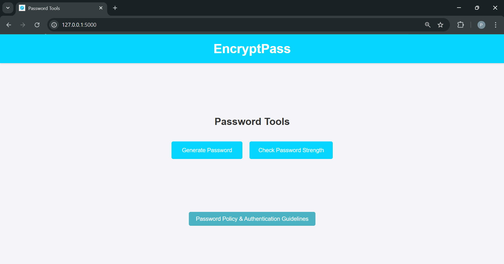
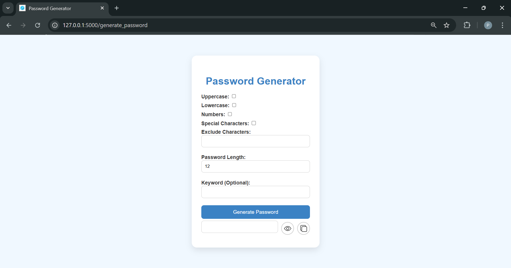
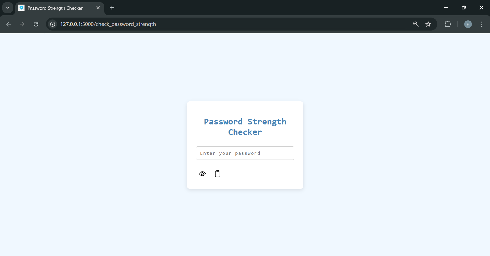
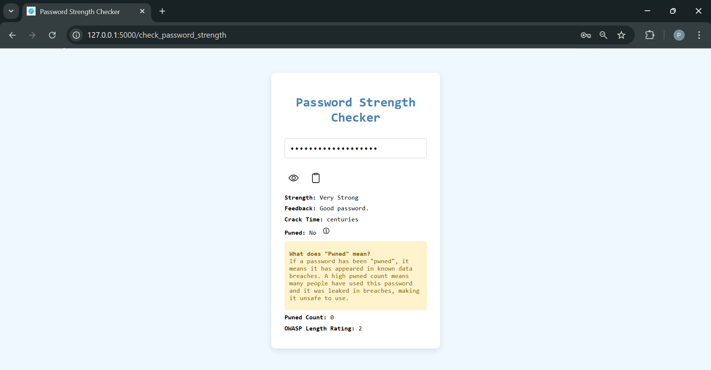
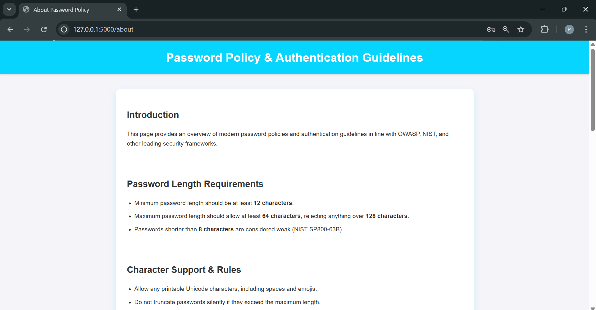

# 🔐 EncryptPass

**EncryptPass** is a Flask-based web application that allows users to generate, check the strength of, and manage secure passwords. It follows best practices from **NIST** and **OWASP** standards, promoting secure password habits and encouraging the use of secure passwords.

---

## 📁 Folder Structure


---

## ⚙️ Main Features

### ✅ Password Generation
- **Max password length**: 64 characters  
- **Minimum length**: Below 8 is considered weak  
- **Supports all character types**: Unicode, whitespace, special characters  
- **Hashes stored passwords**: With salt for added security (uses bcrypt)  
- **No strict requirements**: Uppercase/lowercase rules optional but recommended  
- **Breached password checking**: Check against Pwned Passwords  
- **Strength meter**: Guides users to create stronger passwords (powered by zxcvbn)  
- **Copy-paste functionality**: Easy password copying & editing  
- **Password manager promotion**: Encouraging better password practices  

### ✅ Password Strength Checker
- Visual strength meter (zxcvbn)  
- Blocks weak/common/breached passwords  
- Live feedback on password strength  
- Pwned Passwords API integration (optional for breach check)  

### ✅ Home Page Info
- Overview of password best practices  
- Password security guidelines for users  
- Educates on NIST and OWASP recommendations  

---

## 🛠️ Tech Stack

| Layer         | Technology                 |
|---------------|----------------------------|
| **Backend**   | Python (Flask)             |
| **Frontend**  | HTML, CSS, JavaScript      |
| **Password Handling** | bcrypt, hashlib, zxcvbn |
| **API Integration**   | Optional Pwned Passwords API |

---

## 🚀 Getting Started

### Prerequisites
- Python **3.8+**
- `pip`
- Virtual environment (`venv`)

---

## Installation Steps

```bash
# Clone the repository
git clone https://github.com/yourusername/encryptpass.git
```

```bash
cd encryptpass
```

```bash
# Create virtual environment
python -m venv venv
```

# Activate virtual environment

```bash
# On Windows
venv\Scripts\activate
```

```bash
# On Mac/Linux
source venv/bin/activate
```

## Install required packages
```bash
pip install -r requirements.txt
```

- Or, for minimal installation:
    
```
pip install flask requests bcrypt
```

- Run the App
```bash
python app.py
```

- Then open your browser and navigate to:

```bash
http://127.0.0.1:5000
```

## 🧰 Libraries Used
Here's the minimal list of libraries your project needs:

### Library	Purpose
- Flask	- Web framework
- Requests	- HTTP requests (Pwned Password API)
- bcrypt	- Hashing & salting passwords securely
- hashlib	- Additional hashing utilities

## 📦 Complete list from requirements.txt (for scaling or optional features):

```bash
cryptography==44.0.1
Flask==2.3.2
Jinja2==3.1.5
requests==2.32.3
zxcvbn==4.5.0
```

## 🖼️ Snapshots

### 🔹 Home Page


### 🔹 Password Generator Page


### 🔹 Password Strength Meter Page



### 🔹 About Page


➡️ Replace the above image paths with your actual images in the snapshots/ folder.

## 🔒 Security Highlights
- Checks for breached passwords (via Pwned Passwords)
- Promotes long, complex, and unique passwords

## 📖 References
- NIST Guidelines - Digital Identity
- OWASP Passwords Cheat Sheet
- HaveIBeenPwned - Pwned Passwords

## 🤝 Contributing
Pull requests are welcome!
If you find a bug or have a feature suggestion, open an issue or create a pull request.
